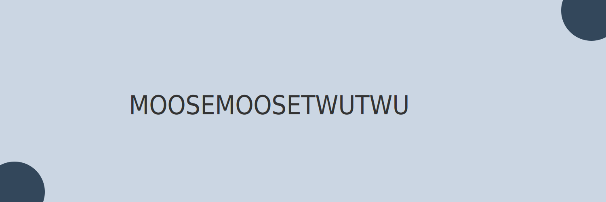

## Hello! 👋

- 💻 I'm a game, website and discord bot developer
- 🌱 Currently learning Discord JS, TypeScript and C#
- 💪 Currently working on [Hello Bot](https://github.com/Moosemoosetwutwu/HelloBot)
- 📦 My biggest project so far: [HelloBot](https://github.com/Moosemoosetwutwu/HelloBot)

## Skills and tools

<code></code>
<code></code>
<code></code>
<code></code>
<code></code>
<code></code>
<code></code>

  

